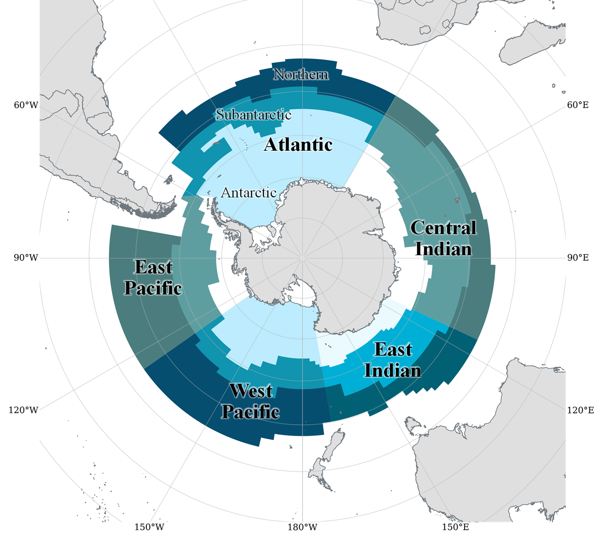
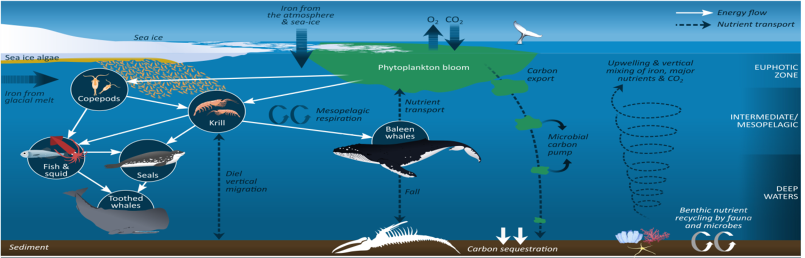
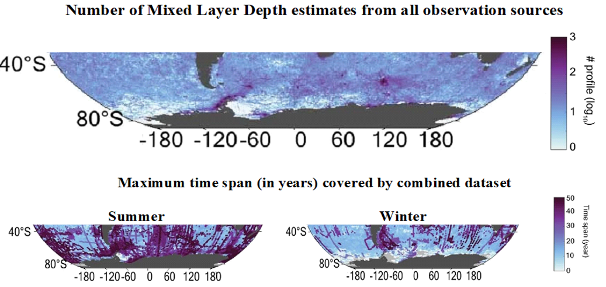
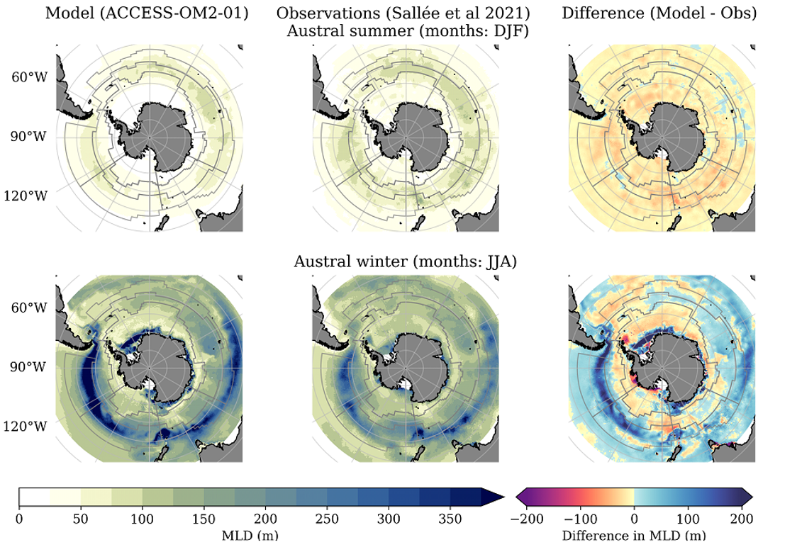
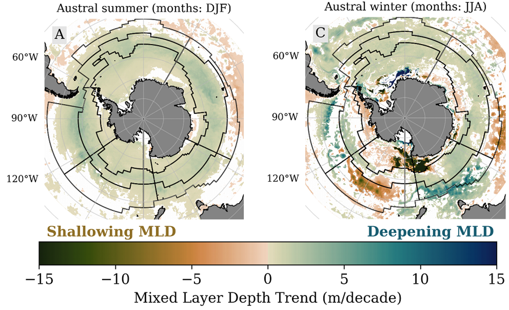

```{r setup, include=FALSE, cache = T}
knitr::opts_chunk$set(echo = FALSE)
library(xaringanExtra)
library(xaringanthemer)

knitr::knit_engines$set("yaml", "markdown")
use_tile_view()
use_clipboard()
use_share_again()
style_share_again(
  share_buttons = c("twitter", "linkedin", "pocket")
)
style_mono_accent(
  white_color = "#0B5394",
  base_color = "#FFFFFF",
  text_color = "#FFFFFF",
  text_font_size = "1.25rem")
```

class: center, middle, titular
background-size: contain
background-position: -100% 0%

# `r rmarkdown::metadata$title` 
## **`r rmarkdown::metadata$author`**
### `r rmarkdown::metadata$subtitle`
`r "Supervisors: Stuart Corney, Amelie Meyer, Andrew Kiss, Petra Heil, Hakase Hayashida \n"`


---

class: inverse

## Background: Southern Ocean (SO)

- Key component of global climate systems
- Disproportionately affected by climate change
- Strong feedback between physical and biological components of SO


<figure>
  
  <figcaption>Marine Ecosystem Assessment for the Southern Ocean (MEASO) regions</figcaption>
</figure>
---

class: inverse

## Our aim

Understand how changes in the physical environment affect the biological component of Southern Ocean ecosystems.

<figure>
  
  <figcaption>Key processes of the biogeochemical cycle in the Southern Ocean (Figure: Henley et al 2020)</figcaption>
</figure>
---

class: inverse
## Our point of difference
We use outputs from an ocean-sea ice coupled model, ACCESS-OM2-01, instead of observations to investigate environmental change and their ecological impact.

<iframe width="660" height="415" style="vertical-align:middle;margin:0px 200px" src="https://www.youtube.com/embed/10rkfW_YsLs" frameborder="0" allow="accelerometer; autoplay" allowfullscreen></iframe>
---

class: inverse
## Why do we use model outputs?
- Regular spatio-temporal coverage
- Data spans multiple decades
- High resolution: access to mesoscale features
- Multiple ecologically relevant variables available
<figure>
  
  <figcaption>Temporal coverage of observational MLD data (Extended Data Figure 2, Sallée et al 2021)</figcaption>
</figure>
---

class: inverse
## But first...
We should consider:
- What is our ecological problem?
  - Identify ecologically relevant variables
- Does the model reproduce past conditions accurately?
  - Does it capture spatio-temporal variability?
  - Compare observations and model outputs
- Does the model replicate mesoscale features?

---

class: inverse
## Some results: Mixed Layer Depth (MLD)
<figure>
  
</figure>

---

class: inverse
## MLD results
### The good
- ACCESS-OM2-01 captures MLD seasonality in the SO
  - Shallow in summer, deeper in winter
- Model captures spatial variability
  - Influence of sea ice and Antarctic Circumpolar Current (ACC)

### The not so good
- ACCESS-OM2-01 shows:
  - Shallow areas to be shallower
  - Deeper areas to be deeper
- Largest misrepresentations in winter and spring
  - ACC and Weddell Sea
  
---

class: inverse
## Results: MLD trends
<figure>
  
</figure>

---

class: inverse
## MLD and Southern Ocean ecosystems
MLD affects primary productivity by:
- Bringing nutrients to the surface
- Regulating amount of light available

MLD also affects productivity at higher trophic levels through:
- Changes to location/timing/intensity of blooms
- Uncoupling of prey-predator relationships
- Changes to composition of phytoplankton communities

---

class: inverse
## Key messages
- ACCESS-OM2-01 replicates reasonably well past MLD climatology and trends
- Past environmental conditions and trends vary across SO
  - Support our use of regions to investigate change
- Need to establish what a “good model” is for ecologists
- Need to provide model outputs and workflows that can be easily accessible and implemented by biologists

---

## FishMIP tool for easier spatial extraction

A series of `R` notebooks are being developed that facilitate data access, processing and visualisation.

These notebooks aim to improve reproducibility and are designed to be highly adaptable.

All notebooks are available here:
### `r fontawesome::fa("github")` [Fish-MIP](https://github.com/Fish-MIP/FishMIP_extracting-data)

Got any suggestions for a new notebook? Get in touch! Create an issue in the repository or get in touch via email.

---

class: middle, center
# Thank you!

Feel free to get in touch if you have questions:

### `r fontawesome::fa("envelope")` [lilian.fierroarcos@utas.edu.au](mailto:lilian.fierroarcos@utas.edu.au)

### `r fontawesome::fa("github")` [lidefi87](https://github.com/lidefi87)

### `r fontawesome::fa("orcid")` [0000-0002-5039-6272](https://orcid.org/0000-0002-5039-6272)

